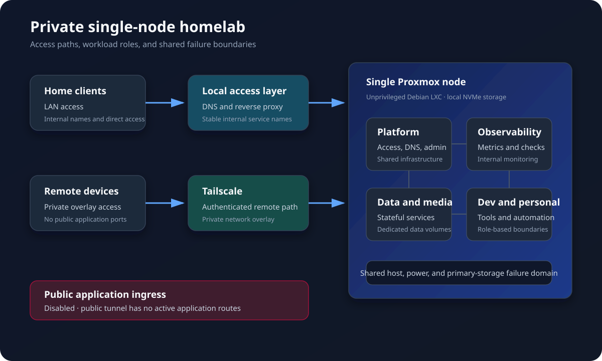

# My Homelab

A practical single-node Proxmox environment that I use for self-hosting, infrastructure learning, and operating services I actually depend on.

This is not a production cluster or a catalogue of every application I have tried. It is a small home server that has grown through real use, outages, migrations, and cleanup. The repository documents what is running, why it is designed this way, how I operate it, and where it is still incomplete.

> **Current snapshot: 2026-08-17.** Operational credentials, addressing, internal names, port mappings, recovery commands, and workload-to-guest mappings are kept in a separate private runbook.

## At a glance

| Layer | Current state |
|---|---|
| Hardware | One HP mini PC, 6-core low-power CPU, 32 GB RAM, 1 TB NVMe |
| Hypervisor | Proxmox VE 9 |
| Compute | 11 unprivileged Debian 12 LXC containers, no VMs |
| Applications | Around 25 platform and user-facing services |
| Access | Private LAN and Tailscale |
| Public ingress | No application is intentionally routed from the public internet |
| Observability | Prometheus, Grafana, Uptime Kuma, and node_exporter |
| Recovery posture | Scheduled local backups exist; separate-host and offsite recovery remain open work |

## What runs here

| Area | Services |
|---|---|
| Media and photos | Jellyfin, Navidrome, Immich |
| Documents and cloud | Paperless-ngx, Nextcloud |
| Development | Forgejo, Woodpecker CI |
| Reading | BookOrbit, Suwayomi, Shelfmark |
| Personal tools | Actual Budget, SparkyFitness, LinguaCafe, LibreTranslate, Obsidian LiveSync |
| Platform | AdGuard Home, Nginx Proxy Manager, Tailscale, Vaultwarden, Portainer |
| Observability | Prometheus, Grafana, Uptime Kuma, node_exporter |
| Automation | Hermes Agent |
| Games | Minecraft Fabric |

## Design choices

### Single node on purpose

The current workload fits on one efficient mini PC. A cluster would add quorum, networking, storage, and recovery complexity without fixing the most important current risk: backups still share a physical failure domain with production.

### LXC first

All workloads run in unprivileged LXC containers. Most application stacks use Docker inside LXC, while a small number of infrastructure services run directly under systemd. This keeps resource overhead low while preserving useful workload boundaries.

### Private by default

Services are reached directly on the home network or through internal names. Tailscale provides remote access without opening application ports publicly. A Cloudflare Tunnel client remains installed, but it has no active application routes.

### Honest reliability claims

Monitoring is established, but disaster recovery is not finished. Scheduled backups currently help with configuration mistakes and broken workloads; they do not protect against loss of the server's only physical disk. That limitation is documented rather than hidden.

## Operational lessons

Three incidents shaped the current design:

1. **A physical move broke the network.** The new router used a different private network, while every workload still expected the old gateway. I restored service by making the Proxmox host bridge the mismatch with routing and NAT instead of renumbering every application.
2. **An accepted overlay route broke return traffic.** A Tailscale route looked harmless in the normal routing table but redirected replies through a separate policy table. Removing the unnecessary accepted route restored connectivity.
3. **A backup failed silently.** The external storage path failed after a power event, while its old notification destination had already been removed. The backup and the alert about the backup failed together.

See [Case studies](docs/case-studies.md) for the diagnosis and lessons from each incident.

## Documentation

- [Architecture](docs/architecture.md): hardware, compute, network shape, storage model, and failure domains
- [Services](docs/services.md): what is running and what each service family does
- [Operations](docs/operations.md): monitoring, maintenance, backups, updates, and current risks
- [Case studies](docs/case-studies.md): real incidents and the reasoning used to resolve them
- [Roadmap](docs/roadmap.md): reliability work that comes before expansion

## Scope

This repository is a public engineering overview, not a rebuild guide or emergency runbook. The private runbook remains the operational source of truth. Public documentation is updated from verified state, then reviewed separately before publication.
